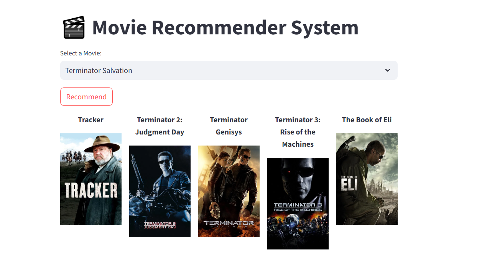

# Movie Recommender System

A web-based movie recommendation app built with **Python**, **Streamlit**, and **scikit-learn**.  
Users can get personalized movie suggestions based on their preferences.

## Features
- Recommends movies based on user input
- Uses a machine learning model
- Streamlit web app with interactive UI

## Tech Stack
- Python (pandas, numpy, scikit-learn, joblib)
- Streamlit for front-end

## Demo

## Deployment
- Deployed on Streamlit Community Cloud: [Live App](https://movierecommendersystem-sjfr8eagbempt58thkut5y.streamlit.app/)

